# Policy Gradient Homework Report

Author: Hao Ren

Date: 18-Feb-2026

Repository: https://github.com/Taardisaa/policy_gradient_homework

## Part 1a: Understanding and Implementing a Basic Policy Gradient Algorithm

I ran the `1_simple_pg_gymnasium.py` and here's the result (the last 5 epochs):

```
epoch:  45       loss: 134.770   return: 220.391         ep_len: 220.391
epoch:  46       loss: 145.005   return: 240.571         ep_len: 240.571
epoch:  47       loss: 180.381   return: 271.211         ep_len: 271.211
epoch:  48       loss: 193.272   return: 283.333         ep_len: 283.333
epoch:  49       loss: 211.870   return: 335.250         ep_len: 335.250
```

### Discussion

**Is the agent learning?**

I believe the agent is learning. The return is increasing over time, which indicates the agent is improving its policy to achieve higher rewards. 

**What happens to it's performance over time?**

Its performance, measured by the return, is generally increasing over time. Therefore the agent is improving its performance over time.

**Is it monotonically improving?**

To evaluate this, I ran the script 6 times and plotted the return over 50 epochs for each run. The plot is shown below:

| | |
|---|---|
| 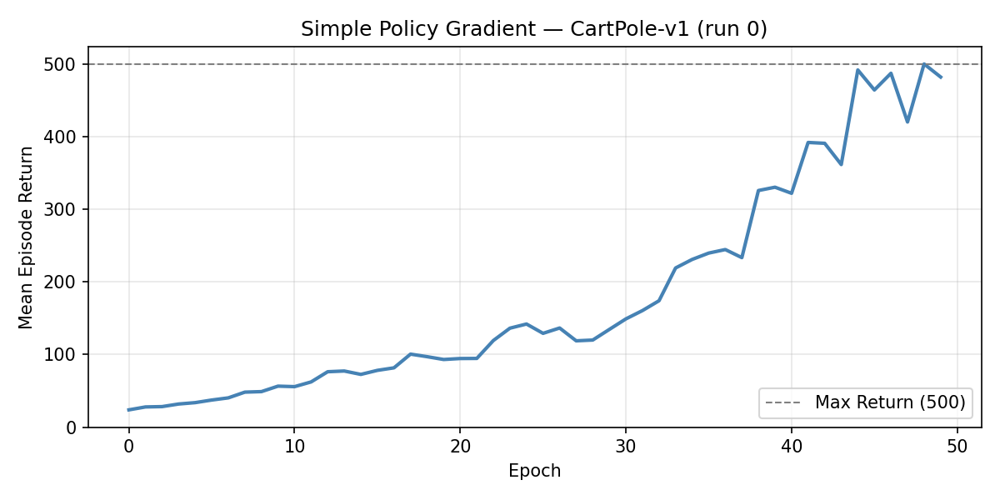 | 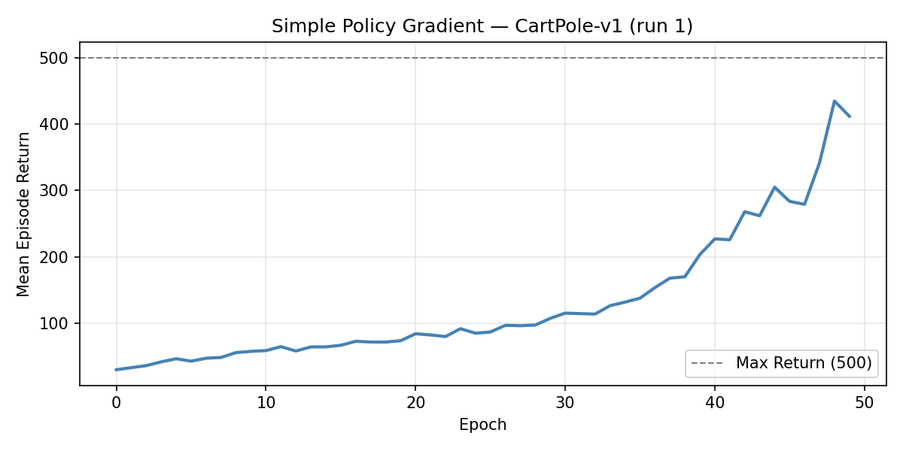 |
|  | 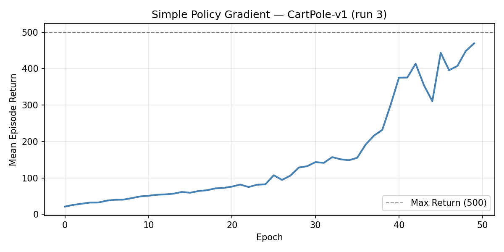 |
| 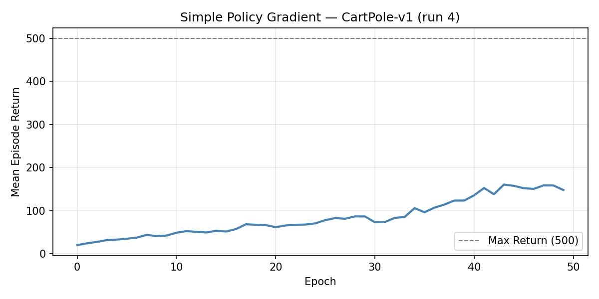 | 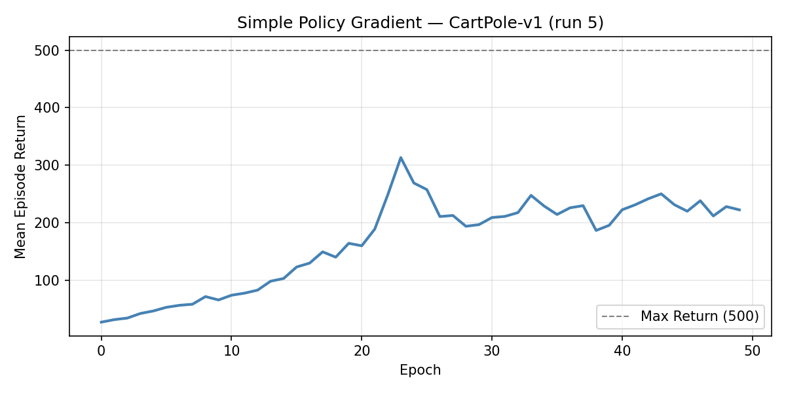 |

As shown above, the return is not monotonically improving. In some runs (run 0, 1, 3), the return increases over the epochs, while in others (run 2, 4, 5), it fluctuates and even decreases at certain epochs. I belive this is a common issue for vanilla policy gradient, because its high variance can lead to unstable learning.

## Part 1b: Understanding and Implementing a Basic Policy Gradient Algorithm

I implemented the render function in `1_simple_pg_gymnasium.py` to visualize the agent's behavior. Below is one of the rendered policies in an epoch:

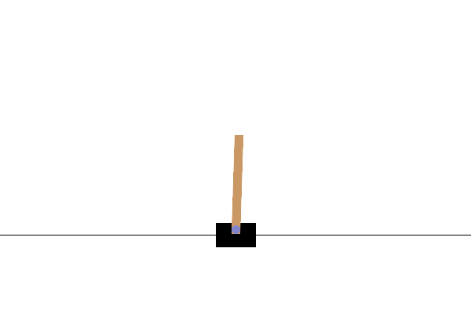

## Discussion

**What do you notice qualitatively about how its policy changes over time?**

In the first few episodes (0~16): The agent failed to make corrective actions in time, resulting in the pole falling down quickly in a direction.

In the middle episodes (17~33): The agent started to learn to make corrective actions in time, but sometimes the actions are too aggressive, causing the cart to move to the edge of the track.

In the final episodes (34~49): The agent learned to make more balanced actions to keep the pole upright for a longer time, and also keep the cart within the track. In the final episode, the agent successfully kept the pole upright for a long time, reaching the maximum return of 500.


## Part 2: Reducing Variance with Reward-to-Go

I added the reward-to-go implementation in `reward_to_go.py` and ran both the vanilla policy gradient and reward-to-go implementations 5 times each. The learning curves are shown below:

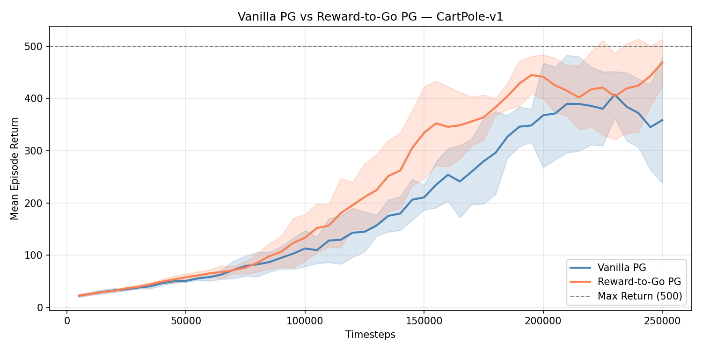

Based on the above result, we can see that the reward-to-go implementation achieves higher returns than the vanilla one on average return.

Therefore, I believe that the reward-to-go implementation is better than the vanilla one, because it reduces the variance of the policy gradient estimates, leading to more stable learning and better performance.

However, the reward-to-go implementation still has some flucturations and drops in the final epochs.

## Part 3: Continuous Actions

I modified the code to use `MLPActorCritic` from `core.py` to make it work for both discrete and continuous action spaces. I tested it on CartPole (discrete) and "InvertedPendulum-v5" (continuous). I actually also tried it on Hopper-v5 and Ant-v5, but the learning was very unstable. I tweaked the hyperparameters a lot but found the best set is still the default one (lr=1e-2, etc.).

For CartPole, it is just like the previous implementation.

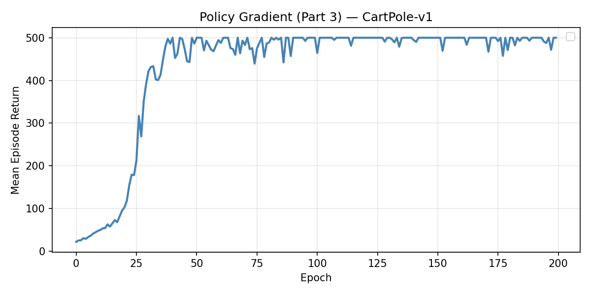

For InvertedPendulum-v5:

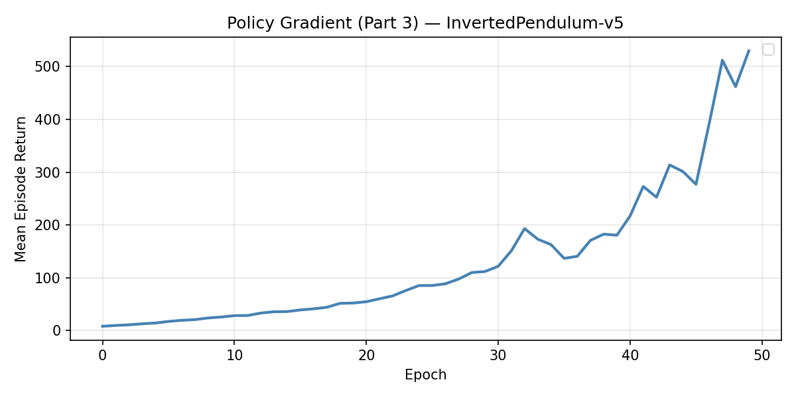

And here's the visualization result:


As shown above, the agent is able to keep the pendulum upright for a long time, until reaching a maximum return of 1000. This indicates that our implementation of policy gradient correctly works for continuous action spaces and can learn a good policy for the InvertedPendulum-v5 environment.

## Extra Credit A: Baselines and Generalized Advantage Estimation

I modified the code to use the critic model to estimate the value function, and implemented the GAE to compute the advantage estimates. I tested it on both CartPole and InvertedPendulum-v5. The learning curves are shown below:

For CartPole:

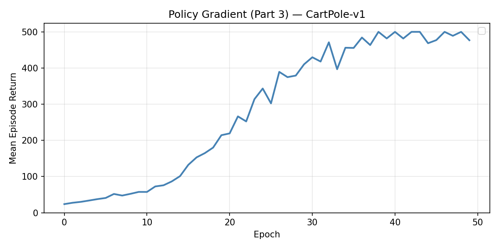

For InvertedPendulum-v5:

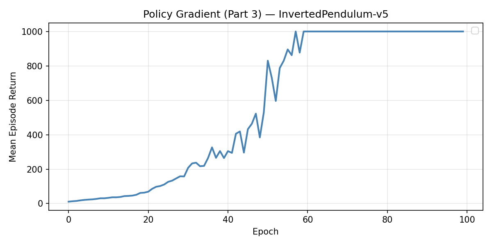

From the above 2 plots, we can see that the policy with GAE achieves higher returns, therefore easily reaching the maximum of 1000 for InvertedPendulum-v5.

### Comparison with Part 3 (no baseline)

To make the benefit of GAE more concrete, I ran both Part 3 (reward-to-go, no baseline) and Extra A (GAE baseline) for 100 epochs on the same environments and plotted their learning curves together:

For CartPole-v1:

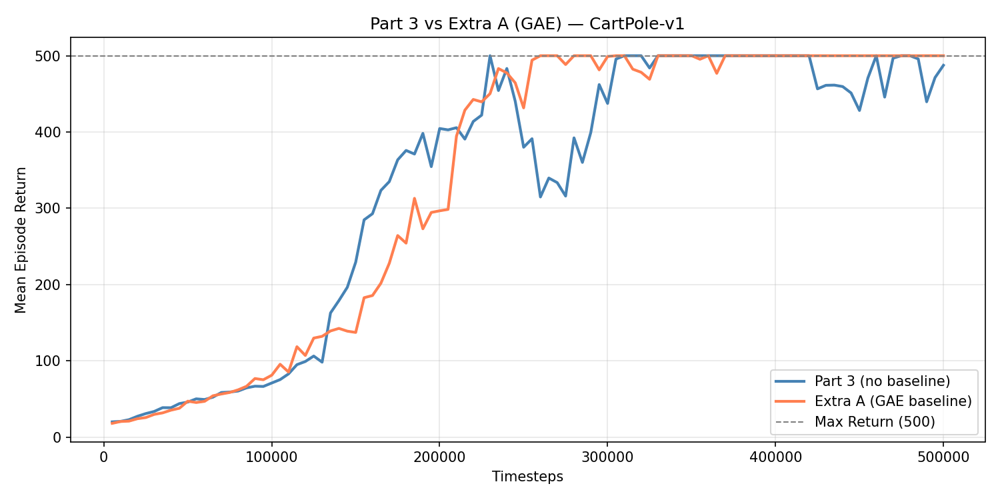

For InvertedPendulum-v5:

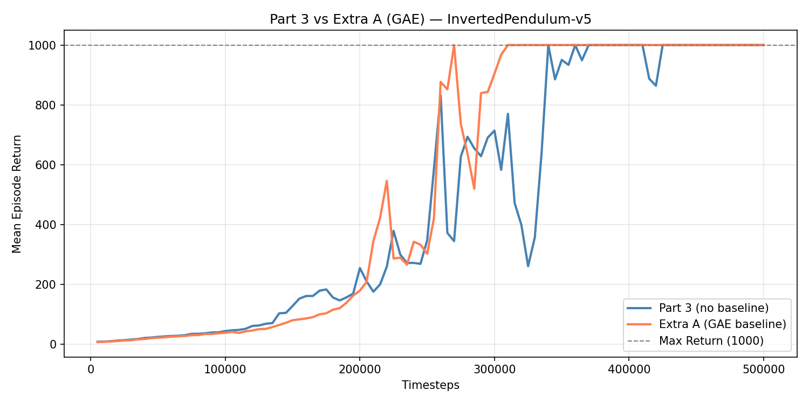

On CartPole-v1 both methods converge to the maximum return, but the GAE baseline reaches it faster. On InvertedPendulum-v5 the advantage is more pronounced: Extra A (GAE) reaches the maximum return of 1000 earlier and sustains it more stably, while Part 3 (no baseline) learns more slowly. This confirms that the value-function baseline reduces gradient variance and leads to more sample-efficient learning.

However, in Ant-v5, the result is not ideal:

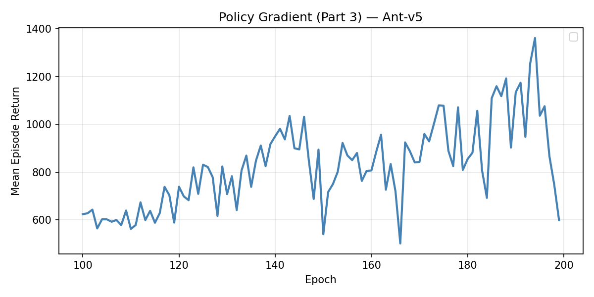

The performance is highly unstable, occasionally reaching rewards around 1400 before dropping to very low values. Visualization reveals that the model fails to learn a forward locomotion policy; instead, the ant simply contorts its legs without productive movement.


## Extra Credit B: Implementing PPO

### Differences between PPO and our primitive design

**Loss Calculation**: PPO uses its clipped surrogate objective to calculate the policy loss:

$$
L^{CLIP}(\theta) = \hat{\mathbb{E}}_t \left[ \min \left( r_t(\theta) \hat{A}_t, \text{clip}(r_t(\theta), 1 - \epsilon, 1 + \epsilon) \hat{A}_t \right) \right]
$$

The related code snipped is shown below:

```python
# Set up function for computing PPO policy loss
def compute_loss_pi(data):
    obs, act, adv, logp_old = data['obs'], data['act'], data['adv'], data['logp']

    # Policy loss
    pi, logp = ac.pi(obs, act)
    ratio = torch.exp(logp - logp_old)  # pi(a|s) / pi_old(a|s), which is $r_t(\theta)$ in the PPO paper.
    # clip
    clip_adv = torch.clamp(ratio, 1-clip_ratio, 1+clip_ratio) * adv
    loss_pi = -(torch.min(ratio * adv, clip_adv)).mean()

    # Useful extra info
    # Approximate KL Divergence.
    approx_kl = (logp_old - logp).mean().item()
    ent = pi.entropy().mean().item()
    clipped = ratio.gt(1+clip_ratio) | ratio.lt(1-clip_ratio)
    clipfrac = torch.as_tensor(clipped, dtype=torch.float32).mean().item()
    pi_info = dict(kl=approx_kl, ent=ent, cf=clipfrac)

    return loss_pi, pi_info
```

**Multiple policy updates per epoch (guarded by KL divergence)**: PPO performs multiple epochs of optimization on the same batch of data (`train_pi_iters`), while our primitive design only performs one update per epoch. This is allowed in PPO because the KL divergence guards against aggressive updates that could lead to training instability.

**PPO Buffer**: PPO uses a buffer with a fixed size to store trajectories. When full, it computes, updates the policy and value function. In contrast, our primitive design collects trajectories via a simple Python list, which isn't as efficient as the PPO buffer.

### Similarities with our primitive design

Despite the differences above, the two approaches share the same fundamental structure:

- **On-policy data collection**: both collect a fresh batch of experience each epoch, compute the update, then discard the data. Neither reuses old transitions like off-policy methods (DQN, SAC).
- **Same actor-critic architecture**: both use `MLPActorCritic` from `core.py` with the same MLP policy and value networks.
- **GAE for advantage estimation**: both compute advantages via GAE-λ, normalize them before the policy update, and use reward-to-go as the value-function regression target.
- **Two separate Adam optimizers**: one for the policy network and one for the value network, trained with the same MSE loss for the value function.
- **Environment interaction loop**: both step through the environment one timestep at a time, record `(obs, act, rew, val, logp)` tuples, and call `finish_path` (or equivalent) at episode / epoch boundaries with a bootstrapped last value when the episode is cut off mid-trajectory.

### What I learned

- **Why the ratio enables multiple updates**: in simple PG the gradient uses the current policy's log-prob directly, so a second pass on the same batch would be on-policy nonsense. PPO introduces the importance-sampling ratio `r_t(θ) = π_θ(a|s) / π_θ_old(a|s)`, which corrects for the fact that data was collected under the old policy. This is what legitimizes reusing the same batch for `train_pi_iters` steps.
- **The clipping is asymmetric in effect**: the `min` in the clipped objective only prevents the ratio from moving further in the *beneficial* direction once it exceeds `1 ± ε`. It does not prevent the ratio from moving in the *harmful* direction — that is left to the KL early-stopping check.
- **`finish_path` unifies two boundary cases cleanly**: a natural terminal state gets `last_val = 0`; an epoch cut-off gets `last_val = V(s_T)` (bootstrap). Both flow through the same GAE formula, which is a particularly clean design.
- **Early stopping on KL is a practical safety net**: even with clipping, the KL can still drift on adversarial batches. Checking `kl > 1.5 * target_kl` and breaking early costs almost nothing and prevents the occasional catastrophic update.

### What is still unclear

- **The `1.5 × target_kl` threshold**: why 1.5 specifically? The SpinningUp code uses it without explanation. It seems empirical, but whether it corresponds to any theoretical bound on policy degradation is not obvious.

### Results

I refactored `ppv.py` to make it work. I tested it on CartPole-v1, InvertedPendulum-v5 and Ant-v5. The learning curves are shown below:

For CartPole-v1:

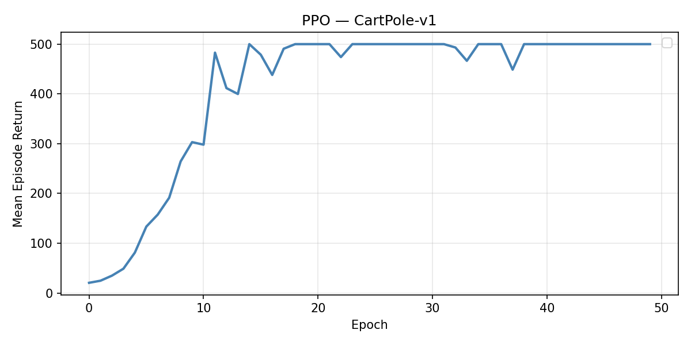

For InvertedPendulum-v5:

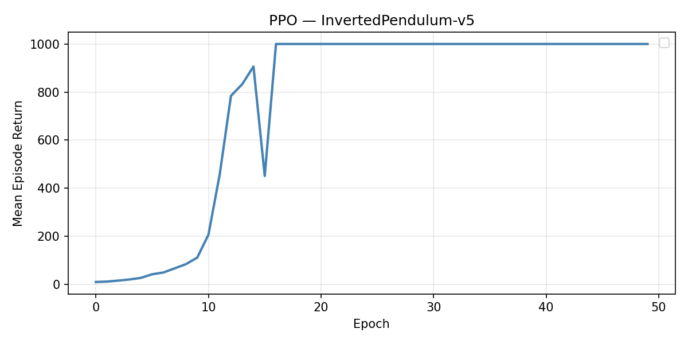

For Ant-v5:

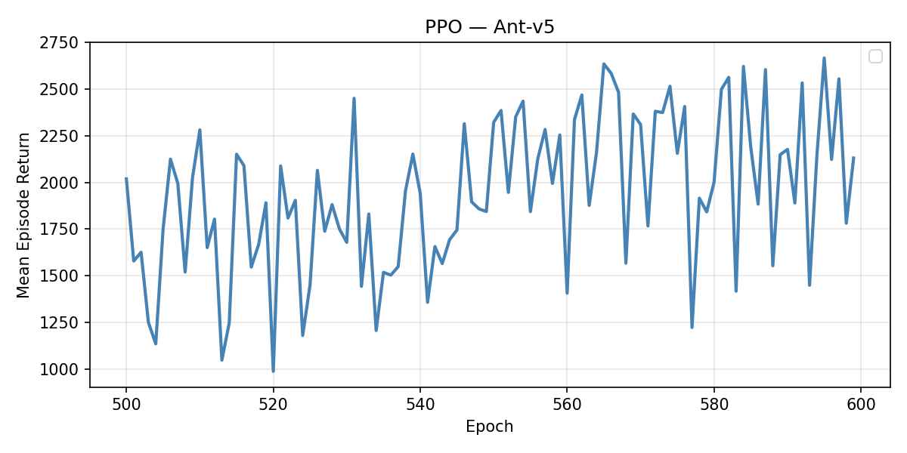

And also their visualizations:

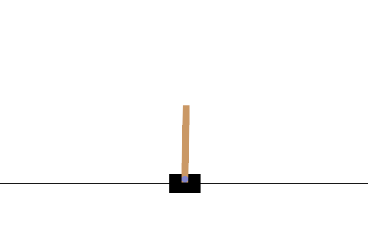


The first 2 environments are very trivial, therefore PPO easily learns a good policy in 50 epochs. However, for Ant-v5, the learning is much harder. But the good news is, PPO is able to learn, and gradually increase its return over time, eventually reaching around 2000 or more after 600 epochs. The visualization also shows that the ant is able to learn to move forward.